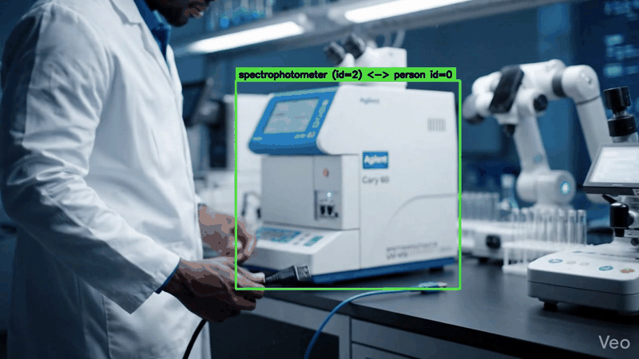

# witness

[](https://github.com/RahulModugula/witness/actions/workflows/test.yml)
[](https://www.python.org/downloads/release/python-3110/)
[](LICENSE)

watches a procedure video and tells you who touched what, when. fastapi
in front, yolo-world + bot-sort + mediapipe in the back, ~25s on cpu for
an 8s clip. json + annotated keyframes out.



built over a weekend as the SDE intern technical assessment for
[Edrevel AI](https://edrevel.com). edrevel's current product qualifies
factory workers through self-assessments and manager grading, and the
[Britannia case study](https://edrevel.com/ai-powered-workforce-development-training-britannia-case-study/)
walks through that across 18 plants and 431 officers. the thing that
isn't in the case study is *did the technician actually follow the SOP
on this particular run*. that's the gap witness slots into.

bundled sample is an 8-second clip of a lab tech plugging a usb cable
into an Agilent Cary 60 spectrophotometer.

## run it

```
make setup
make verify          # real ML pipeline on data/uploads/sample.mp4
```

or use the http api:

```
make run             # fastapi on :8000
make demo            # in another shell: curl through the api end-to-end
```

ui at `localhost:8000`, swagger at `/docs`.

## numbers from the bundled sample

cpu-only, m1 max:

```
pipeline wall time     25.7s on the 8s sample (~3x real-time)
objects detected       10 (5 distinct classes)
interactions found     5 (technician ↔ spectrophotometer)
keyframes saved        24
pytest                 34 cases, 0.8s
```

per-stage breakdown (also reported in the result json under
`videoMetadata.stage_timings`):

```
detect + track         21.7s   84%   yolo-world inference + bot-sort
hand pose               3.6s   14%   mediapipe over each frame
assemble + keyframes    0.3s    1%   motion + interaction + bbox draws
```

detection dominates. if i needed to halve the wall time the lever is
an onnx export + int8 quantization of the detector. the pure-function
math layer is essentially free.

## what the pipeline does

```
   browser/curl ──POST /tasks──▶  fastapi
                                    │ BackgroundTasks
                                    ▼
                  ┌─────────────────────────────────────┐
                  │  yolo-world v2  +  bot-sort tracker │
                  │              │                       │
                  │              ▼                       │
                  │  track_merge (dedupe fragmented IDs) │
                  │              │                       │
                  │              ▼                       │
                  │  mediapipe hands (21 landmarks)      │      sqlite
                  │              │                       │   ┌──────────┐
                  │              ▼                       │◀──┤  tasks   │
                  │  motion + interaction (pure fn)      │   └──────────┘
                  │              │                       │
                  │              ▼                       │      data/results/
                  │  assemble + pydantic-validate ───────┼──▶  data/keyframes/
                  └─────────────────────────────────────┘
```

modules in `app/`:

```
main.py              fastapi routes, error handlers, lifespan warmup
tasks.py             background task entry, status transitions
db.py + models.py    sqlalchemy 2.x, one tasks table
schemas.py           pydantic io + ResultPayload
pipeline/
  detector.py        yolo-world wrapper, lazy singleton
  pose.py            mediapipe hands wrapper
  track_merge.py     post-process: collapse same-class duplicates
  motion.py          pure-fn motion classification
  interaction.py     pure-fn interaction detection
  keyframes.py       pick + annotate + save jpgs
  assemble.py        glue
```

## api

| method | path | what |
|--------|------|------|
| POST   | `/tasks` | upload a video, returns 201 with `task_id` |
| GET    | `/tasks` | paginated list (`?limit=20&offset=0`) |
| GET    | `/tasks/{id}` | task status |
| GET    | `/tasks/{id}/result` | full result. 409 if not done, 500 if failed |
| GET    | `/tasks/{id}/keyframes/{filename}` | serve a saved jpg |
| GET    | `/health` | `{status, version, model}` |
| GET    | `/docs` | auto swagger |
| GET    | `/` | upload ui |

errors share one shape: `{"detail": "...", "code": "..."}`. openapi spec
is at [`docs/openapi.json`](docs/openapi.json).

```
curl -X POST -F "file=@data/uploads/sample.mp4" http://localhost:8000/tasks
# {"task_id":"<uuid>","status":"PENDING",...}

curl http://localhost:8000/tasks/<uuid>/result | jq .
```

## result schema

matches the brief's required fields plus a few i needed for keyframe urls
and the latency story. validated on every write through
`app/schemas.py::ResultPayload`.

```json
{
  "videoMetadata": {
    "filename": "sample.mp4",
    "duration_seconds": 8.0, "frame_count": 192, "fps": 24.0,
    "width": 1280, "height": 720, "codec": "h264",
    "processing_time_seconds": 25.7,
    "model": "yolov8s-worldv2.pt", "tracker": "botsort",
    "degraded_interaction": false,
    "stage_timings": {
      "detect_track_seconds": 21.7,
      "hand_pose_seconds": 3.6,
      "assemble_keyframes_seconds": 0.3
    }
  },
  "objectsDetected": [
    {
      "object_id": 2,
      "class": "spectrophotometer",
      "confidence_avg": 0.47,
      "first_seen_frame": 0, "last_seen_frame": 191,
      "motion_history": [
        {"frame_range": [0, 140], "state": "stationary"},
        {"frame_range": [141, 150], "state": "moving"},
        {"frame_range": [151, 191], "state": "stationary"}
      ],
      "interactions": [
        {"interacted_by_person": 0, "frame_start": 12, "frame_end": 18},
        {"interacted_by_person": 0, "frame_start": 113, "frame_end": 124}
      ]
    }
  ],
  "keyFrames": [
    {
      "frame_number": 119, "type": "interaction_peak", "object_id": 2,
      "image_path": "keyframes/<task_id>/obj2_interaction_119.jpg",
      "url": "/tasks/<task_id>/keyframes/obj2_interaction_119.jpg"
    }
  ]
}
```

## how it works

### detection

coco has 80 classes. spectrophotometer and cable aren't in any of them.
yolo-world takes a list of plain-english class prompts at runtime and
matches clip embeddings to image regions, so detection is zero-shot. i
use the small v2 weights. classes get set once at construction because
calling `set_classes` repeatedly hits a torch version-counter bug in
ultralytics 8.3.x.

### tracking

bot-sort is the ultralytics default since yolo11 and adds global motion
compensation to bytetrack. tuned config at
`app/pipeline/botsort_tuned.yaml`. two changes from default:
`track_buffer 30 → 60` so a brief hand occlusion doesn't kill the track,
`match_thresh 0.8 → 0.7` for easier re-id after that occlusion.
`persist=True` keeps ids alive across the streamed inference.

### dedupe fragmented tracks

if you give yolo-world multiple synonyms (`spectrophotometer` and
`scientific instrument`), both fire on the same physical object and you
get two track ids. `track_merge.py` walks the tracker output and unions
same-class tracks whose mean bboxes have iou ≥ 0.3, using the lower id
as root. same-frame collisions get nms-resolved. six unit tests pin the
invariants. cuts the sample's raw 16+ tracks down to 10 stable objects.

### motion classification

per track: centroid + bbox diagonal per frame. mean displacement over a
5-frame window, normalized by bbox diagonal so it's scale-invariant.
compare to threshold 0.015. hysteresis with min_run=3 so a state change
has to persist for 3 frames or it gets absorbed (kills flicker). missing
frames inherit the prior state so the output covers `[0, n-1]` exactly
with no holes. thresholds all live in `app/config.py`.

### interaction detection

mediapipe gives 21 landmarks per detected hand. fingertips (indices 4,
8, 12, 16, 20) are the physical contact points. a frame counts as
interacting iff:

1. at least one fingertip is inside the object's bbox, expanded by 15%
   for near-miss tolerance.
2. the hand's wrist landmark is inside the person's bbox. this is the
   ownership check. without it multi-person scenes cross-attribute hands.

same hysteresis as motion. per-frame fingertip counts also drive
keyframe selection.

fallback: if mediapipe finds zero hands across the entire video (rare),
drop to `iou(person, object) > 0.05` and set `degraded_interaction:
true`. on the sample this doesn't fire (hands are found in 180/192
frames).

### keyframes

two kinds per object: `motion_transition` (first frame of each new
motion state interval) and `interaction_peak` (frame inside each
interaction interval with the most fingertips in the bbox). each saved
jpg gets the bbox drawn on it (green for interactions, amber for
motion) plus a label like `spectrophotometer (id=2) <-> person id=0`,
so you can look at the image and instantly see what was detected without
reading the json.

### tasks + storage

`BackgroundTasks` runs the pipeline after the response returns. sqlite
via sqlalchemy 2.x. one `tasks` table. result jsons go to disk, the db
just stores the path. detector + pose extractor are module-level
singletons warmed up in fastapi's lifespan hook, so the ~3s model load
happens at startup not on the first request.

## stuff that doesn't work

- **cable isn't detected on this sample.** yolo-world v2 small can't
  find the usb cable in any of the 192 frames, even with several
  cable-adjacent prompts. the sample is a synthetic veo-generated clip
  and the model's open-vocab embedding is weak on thin objects in
  synthetic footage. `yolov8m-worldv2` does detect the cable but trades
  away spectrophotometer recall in the early frames, which kills the
  interaction count. shipped with -s. real fix is a fine-tune on
  customer footage.
- **two spectrophotometer track ids survive merging.** they have low
  mean-bbox iou (slightly different crops from competing prompts). the
  one with actual interactions captures all 5 cleanly so the output is
  fine. real fix is a learned re-id head.
- **wrist-in-bbox ownership has a wide-shot edge case** where the
  person bbox can miss the wrist of a hand reaching across frame.
  doesn't bite on this sample. fallback would be
  `iou(hand_bbox, person_bbox)`.

## tests

```
make test            # 34 passed in ~0.8s
```

| file | what it covers |
|------|----------------|
| test_motion.py (9) | centroid math, hysteresis, gap-fill, full-range coverage |
| test_interaction.py (11) | fingertip-in-bbox, wrist ownership, min-run, iou fallback |
| test_track_merge.py (6) | same-class merge, cross-class isolation, nms resolution |
| test_assemble.py (1) | full payload passes pydantic schema |
| test_api.py (7) | upload + lifecycle + 4xx paths via TestClient |

api tests use `STUB_PIPELINE=1` so they don't need the yolo weights —
the real ml path is exercised separately by `make verify`. `RUN_INLINE=1`
makes the background task run synchronously inside the request handler
so tests are deterministic.

ci at `.github/workflows/test.yml` runs the same suite on every push.

## tradeoffs i made

- **BackgroundTasks over celery/arq.** right for a single-process demo,
  wrong for production. upgrade path is arq before reaching for celery.
- **sqlite over postgres.** one file, no external deps. postgres + alembic
  when you need to survive process restarts in production.
- **class list set at startup.** repeated `set_classes` hits a torch bug.
  if dynamic vocab per request becomes a product requirement the right
  shape is one worker process per active vocabulary, behind a router.
- **geometric interaction heuristic.** defensible for a one-day build. a
  learned hoi model (100doh-style) would distinguish "fingertip near"
  from "fingertip gripping". concrete replacement target.
- **jpg q=90 keyframes** (~140kb each). png would be 5-10x larger for
  no gain on synthetic frames.
- **cpu-only.** gpu would be ~3-5x faster but the brief explicitly avoids
  gpu assumptions.

deliberately left out: docker, auth, cors, websockets, alembic, multiple
workers. each would be positive in production. putting them in a
take-home signals can't-scope.

## next, if i had more time

mapped to edrevel's product surface, not generic polish. the through-line
is: britannia today gets quarterly manager-graded self-assessment. with
witness they'd get per-procedure objective verification.

1. **sop dsl that runs against the json trace.** the current output is a
   *trace*. compliance is a *check*. a small dsl like
   `interaction(person, calibration_solution) BEFORE interaction(person, spectrophotometer)`
   lets the existing course creator produce both training modules and a
   runnable compliance check from the same sop document. smallest piece
   that unlocks the largest product wedge.
2. **fine-tune yolo-world on real customer footage** (plant equipment,
   ppe, hand tools). directly fixes the cable miss. ~1 day of label
   work + a few hours training.
3. **learned hoi model** instead of the geometric heuristic.
4. **kiosk-mode capture path.** britannia is already on factory-floor
   kiosks. witness would slot in as press-record-then-walk-away.
5. **aws-native deployment.** s3 for videos, sqs/eventbridge for the
   queue, fargate for workers (model weight is too big for lambda
   cold-start), rds postgres for metadata, kms-signed result blobs for
   audit immutability. matches edrevel's existing aws posture.
6. **audit-log immutability.** procedure traces for regulated customers
   should be append-only and signed. aligns with fda 21 cfr part 11
   expectations any life-sciences expansion will hit, and with the
   existing soc 2 type ii posture.
7. **websocket progress updates** instead of polling. per-object
   segmentation masks (yolo-world has a -seg variant) for pixel-precise
   interaction tests when bbox proximity isn't enough.
8. **worker pool + arq + load balancer** to handle real concurrency.

## stack

```
fastapi[standard]==0.115.6   uvicorn[standard]==0.32.1
sqlalchemy==2.0.36           pydantic==2.10.4    pydantic-settings==2.7.0
ultralytics==8.3.55          opencv-python-headless==4.10.0.84
mediapipe==0.10.18           numpy==1.26.4       pillow==11.0.0
pytest==8.3.4                pytest-asyncio==0.25.0   httpx==0.28.1
```

python 3.11. cpu-only. no paid apis. model weights download on first
run (~25mb for the s model).

## layout

```
witness/
├── app/
│   ├── main.py            fastapi routes + handlers
│   ├── tasks.py           background pipeline entry
│   ├── config.py          pydantic-settings: thresholds, prompts, paths
│   ├── db.py, models.py   sqlalchemy 2.x
│   ├── schemas.py
│   ├── storage.py, logging_config.py
│   └── pipeline/
│       ├── detector.py    yolo-world + bot-sort
│       ├── pose.py        mediapipe hands
│       ├── track_merge.py
│       ├── motion.py      pure-fn motion logic
│       ├── interaction.py pure-fn interaction logic
│       ├── keyframes.py   pick + annotate + save
│       ├── assemble.py    glue
│       ├── video.py
│       └── botsort_tuned.yaml
├── static/                drag-and-drop ui
├── tests/                 34 cases
├── scripts/               make verify entry + helpers
├── docs/                  openapi.json, sample_result.json, hero frames
├── data/uploads/sample.mp4
├── .github/workflows/test.yml
├── Makefile, requirements.txt, pyproject.toml
├── CONTRIBUTING.md, CODE_OF_CONDUCT.md, SECURITY.md
├── LICENSE
└── README.md
```

## contributing + license

see [CONTRIBUTING.md](CONTRIBUTING.md). by participating you agree to
the [CODE_OF_CONDUCT.md](CODE_OF_CONDUCT.md). security issues go through
[SECURITY.md](SECURITY.md).

MIT. see [LICENSE](LICENSE).

## time spent

about 7 hours: ~4 on the pipeline (detector, tracker, motion,
interaction, keyframes, assembly), ~1.5 on the api + db + tests, ~1.5
on the empirical investigation of detection quality + this readme.
