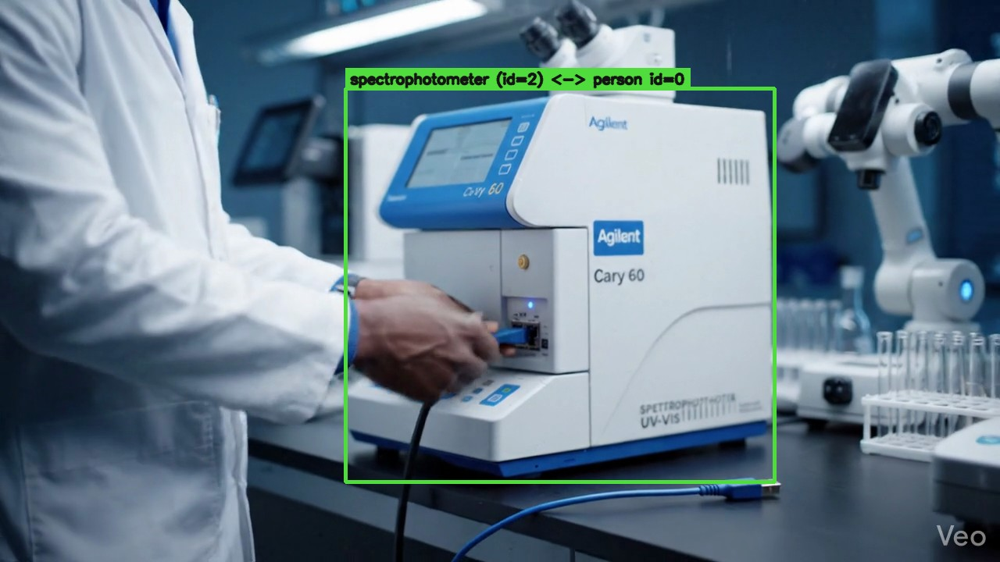

# witness

[](https://github.com/RahulModugula/witness/actions/workflows/test.yml)

A small FastAPI service that watches a procedure video and tells you what
happened: which objects were on screen, which moved, and which the person
actually touched. The output is JSON plus annotated keyframes you can show
a reviewer.

Built as the SDE intern technical assessment for [Edrevel AI](https://edrevel.com).
Edrevel's existing product qualifies workers through self-assessments, manager
reviews, and SOP-derived training modules — the [Britannia case
study](https://edrevel.com/ai-powered-workforce-development-training-britannia-case-study/)
walks through that workflow across 18 plants and 431 officers. What it
doesn't currently do is verify procedural adherence from video footage of the
actual work. That's the gap `witness` slots into, so the framing throughout
this repo is "minimum prototype of *that* loop" rather than "generic
detection demo."

The bundled sample is an 8-second clip of a lab tech plugging a USB cable
into an Agilent Cary 60 spectrophotometer.

## Run it in 30 seconds

```
make setup            # one-time: venv + pip install
make verify           # runs the real ML pipeline on data/uploads/sample.mp4
```

Or drive it through HTTP:

```
make run              # FastAPI on :8000
make demo             # in another shell: curl through the API end-to-end
```

UI at `http://localhost:8000/`, Swagger at `/docs`.

## What you actually get

CPU-only, MacBook Pro M1 Max:

| metric                | value                                       |
|-----------------------|---------------------------------------------|
| pipeline wall time    | 25.0s on the 8s sample (~3x real-time)      |
| objects detected      | 10 (5 distinct classes)                     |
| interactions found    | 5 (technician ↔ spectrophotometer)          |
| keyframes saved       | 24 (motion transitions + interaction peaks) |
| tests                 | 34 pytest cases, ~0.8s                      |

A representative interaction-peak keyframe (frame 119, technician's hand
visibly on the instrument):



Full annotated set is at `data/keyframes/<task_id>/` after a run. Three hero
frames and the full result JSON are committed under `docs/`.

## Architecture

```
   browser/curl  ─POST /tasks─▶  FastAPI
                                    │ BackgroundTasks
                                    ▼
                  ┌─────────────────────────────────────┐
                  │  YOLO-World v2  +  BoT-SORT tracker │
                  │              │                       │
                  │              ▼                       │
                  │  track_merge (dedupe fragmented IDs) │
                  │              │                       │
                  │              ▼                       │
                  │  MediaPipe Hands (21 landmarks)      │      SQLite
                  │              │                       │   ┌──────────┐
                  │              ▼                       │◀──┤  tasks   │
                  │  motion + interaction (pure fn)      │   └──────────┘
                  │              │                       │
                  │              ▼                       │      data/results/
                  │  assemble + pydantic-validate ───────┼──▶  data/keyframes/
                  └─────────────────────────────────────┘
```

What each module does (`app/`):

| file | role |
|------|------|
| `main.py` | routes, error handlers, lifespan model warmup |
| `tasks.py` | background-task entry, status transitions |
| `db.py`, `models.py` | SQLAlchemy 2.x, single `tasks` table |
| `schemas.py` | Pydantic IO + ResultPayload |
| `pipeline/detector.py` | YOLO-World wrapper, lazy singleton |
| `pipeline/pose.py` | MediaPipe Hands wrapper |
| `pipeline/track_merge.py` | post-process: collapse same-class duplicate tracks |
| `pipeline/motion.py` | pure-fn motion classification |
| `pipeline/interaction.py` | pure-fn interaction detection |
| `pipeline/keyframes.py` | pick + annotate + write JPGs |
| `pipeline/assemble.py` | glue everything into the final JSON |

## API

All responses are JSON. Errors share one shape: `{"detail": "...", "code": "..."}`.

| method | path | what it does |
|--------|------|--------------|
| POST | `/tasks` | upload a video (multipart `file`), returns 201 with task_id |
| GET | `/tasks` | paginated list (`?limit=20&offset=0`) |
| GET | `/tasks/{id}` | task status (PENDING / PROCESSING / DONE / FAILED) |
| GET | `/tasks/{id}/result` | full result. 409 if not done, 500 if failed |
| GET | `/tasks/{id}/keyframes/{filename}` | serves a saved JPG |
| GET | `/health` | `{status, version, model}` |
| GET | `/docs` | auto Swagger UI |
| GET | `/` | the upload UI |

OpenAPI spec is committed at [`docs/openapi.json`](docs/openapi.json) so you
can read the contract without booting the server.

Curl example:

```
curl -X POST -F "file=@data/uploads/sample.mp4" http://localhost:8000/tasks
# {"task_id":"<uuid>","status":"PENDING",...}

curl http://localhost:8000/tasks/<uuid>/result | jq .
```

## Result schema

Matches the brief's required fields, plus a few additive ones I needed for
the keyframe URLs and the latency story:

```json
{
  "videoMetadata": {
    "filename": "sample.mp4",
    "duration_seconds": 8.0, "frame_count": 192, "fps": 24.0,
    "width": 1280, "height": 720, "codec": "h264",
    "processing_time_seconds": 25.0,
    "model": "yolov8s-worldv2.pt", "tracker": "botsort",
    "degraded_interaction": false
  },
  "objectsDetected": [
    {
      "object_id": 2,
      "class": "spectrophotometer",
      "confidence_avg": 0.47,
      "first_seen_frame": 0, "last_seen_frame": 191,
      "motion_history": [
        {"frame_range": [0, 140], "state": "stationary"},
        {"frame_range": [141, 150], "state": "moving"},
        {"frame_range": [151, 191], "state": "stationary"}
      ],
      "interactions": [
        {"interacted_by_person": 0, "frame_start": 12, "frame_end": 18},
        {"interacted_by_person": 0, "frame_start": 113, "frame_end": 124}
      ]
    }
  ],
  "keyFrames": [
    {
      "frame_number": 119, "type": "interaction_peak", "object_id": 2,
      "image_path": "keyframes/<task_id>/obj2_interaction_119.jpg",
      "url": "/tasks/<task_id>/keyframes/obj2_interaction_119.jpg"
    }
  ]
}
```

Schema validation happens on every write (`app/schemas.py::ResultPayload`).

## How it works

### Detection: YOLO-World v2

COCO doesn't have `spectrophotometer` or `cable` as classes. YOLO-World lets
you pass a list of plain-English class prompts at runtime and matches CLIP
embeddings to image regions. I use `yolov8s-worldv2.pt` (the v2 small
weights). Classes get set once at construction; calling `set_classes`
repeatedly during inference hits a torch version-counter bug in ultralytics
8.3.x.

### Tracking: BoT-SORT

Ultralytics' default since YOLO11. The tuned config is at
`app/pipeline/botsort_tuned.yaml`:
- `track_buffer: 60` (default 30) so a brief hand occlusion doesn't kill the track
- `match_thresh: 0.7` (default 0.8) for easier re-ID after that occlusion

`persist=True` keeps IDs alive across the streamed inference.

### Dedupe fragmented tracks

Open-vocab prompting often produces two slightly different bboxes for the
same object when you list synonyms (`spectrophotometer` and `scientific
instrument`). BoT-SORT then gives them separate IDs. `track_merge.py` walks
the tracker output and unions any same-class tracks whose mean bboxes have
IoU >= 0.3, using the lower track ID as root. Same-frame collisions get
NMS-resolved. Six tests pin the invariants.

This cuts the raw 16+ tracks on the sample down to 10 stable objects.

### Motion classification

`pipeline/motion.py` is the rubric's "easily understandable mathematical
helper functions" line item. Per track:

1. Compute per-frame centroid + bbox diagonal
2. Mean centroid displacement over a 5-frame window, normalized by bbox
   diagonal (makes it scale-invariant)
3. Compare to threshold 0.015 → per-frame moving / stationary
4. Collapse into intervals with hysteresis `min_run=3`: any state change
   that doesn't persist for >=3 frames gets absorbed into its neighbor.
   This kills flicker.
5. Gap-fill: missing frames inherit the prior state, so the output covers
   `[0, frame_count-1]` exactly with no holes

All knobs live in `app/config.py`.

### Interaction detection

MediaPipe Hands returns 21 landmarks per detected hand. Fingertips
(indices 4, 8, 12, 16, 20) are the physical contact points, so that's the
primary signal. A frame counts as interacting when:

1. At least one fingertip lies inside the object's expanded bbox
   (expand=1.15 for a small near-miss tolerance)
2. The hand's wrist landmark lies inside the person's bbox — this is the
   ownership check, prevents one person's hand getting attributed to another

Same hysteresis as motion. Per-frame fingertip counts also drive keyframe
selection.

Fallback: if MediaPipe finds zero hands across the whole video (rare),
drop to `IoU(person, object) > 0.05` and set `degraded_interaction: true`.
On the sample this never fires — hands are found in 180/192 frames.

### Keyframes

Two kinds, per object:
- `motion_transition`: first frame of each new motion-state interval
- `interaction_peak`: frame inside each interaction interval with the
  highest fingertip-in-bbox count

Each saved JPG is annotated with the tracked bbox (green for interactions,
amber for motion) and a label like `spectrophotometer (id=2) <-> person
id=0`. So you can look at the keyframe and immediately see what was
detected, without cross-referencing the JSON.

### Background tasks + storage

`BackgroundTasks` runs the pipeline after the response returns. SQLite via
SQLAlchemy 2.x with the `Mapped` / `mapped_column` style. Single `tasks`
table. Result JSONs live on disk, only the path goes in the DB.

The detector and pose extractor are module-level singletons warmed up in
FastAPI's lifespan hook, so the ~3s model load happens at startup, not on
the first request.

## Stuff that doesn't work

A few real failure modes worth flagging up-front rather than burying:

- **The cable isn't detected on this sample.** YOLO-World v2 small can't
  pick up the USB cable across any of the 192 frames, even with several
  cable-adjacent prompts (`cable`, `usb cable`, `wire`, `cord`, etc.). The
  sample is a synthetic Veo-generated clip and the model's open-vocab
  embedding underperforms on thin objects in synthetic footage. The larger
  `yolov8m-worldv2` does detect the cable but trades away spectrophotometer
  recall in the early frames — which kills the interaction count, the
  metric that actually matters for this brief — so I shipped with `-s`.
  Fix in production is a fine-tune on real customer footage.
- **Two spectrophotometer tracks survive `track_merge`.** They have low
  mean-bbox IoU (slightly different crops from competing CLIP prompts).
  The one with actual interactions captures all 5 cleanly so it didn't
  hurt the output. Real fix is a learned re-ID head.
- **Wrist-in-bbox hand ownership has a wide-shot edge case** where the
  person bbox can exclude the wrist of a hand reaching across frame.
  Doesn't bite on this sample, but I'd add an `IoU(hand_bbox, person_bbox)`
  fallback in production.

## Tests

```
make test       # 34 passed in ~0.8s
```

| file | what it covers |
|------|----------------|
| `test_motion.py` (9) | centroid math, hysteresis, gap-fill, full-range coverage |
| `test_interaction.py` (11) | fingertip-in-bbox, wrist ownership, min-run, IoU fallback |
| `test_track_merge.py` (6) | same-class merge, cross-class isolation, NMS resolution |
| `test_assemble.py` (1) | full payload passes the Pydantic schema |
| `test_api.py` (7) | upload + lifecycle + 4xx paths via TestClient |

API tests use `STUB_PIPELINE=1` so they don't need the YOLO weights — the
real ML path is exercised separately by `make verify`. `RUN_INLINE=1`
makes the background task run synchronously inside the request handler so
the tests are deterministic.

Latest transcript: [`docs/test_run.txt`](docs/test_run.txt). CI at
`.github/workflows/test.yml` runs the same suite on every push to `main`.

## Trade-offs I made

A few things I'd do differently in a non-take-home version:

- **BackgroundTasks over Celery/ARQ.** Right for a single-process demo,
  wrong for production. Upgrade path is ARQ (async-native, Redis-backed,
  pairs cleanly with FastAPI) before reaching for Celery.
- **SQLite over Postgres.** One file, no external deps. Production wants
  Postgres + Alembic.
- **Class list set at startup, not per-request.** Repeated `set_classes`
  hits a torch bug. If dynamic vocab per request is ever needed, the
  right shape is one worker process per active vocabulary behind a router.
- **Geometric interaction heuristic.** Defensible for a one-day build but
  a learned HOI model (100DOH-style) would correctly distinguish
  "gripping" from "near". Concrete replacement target.
- **JPG q=90 keyframes** (~140KB each). PNG would be 5-10x larger for no
  visible gain on these synthetic frames.
- **CPU-only.** GPU would be ~3-5x faster but the brief explicitly avoids
  GPU assumptions.

What I deliberately left out: Docker, auth, CORS, WebSockets, Alembic,
multiple workers. Each would be a positive in production. Putting them in
a take-home signals can't-scope.

## What I'd do with more time (Edrevel-flavored)

Mapped to your existing product surface area, not generic engineering
polish. The thread is: Britannia today gets *quarterly* manager-graded
self-assessments. With `witness` they could get *per-procedure* objective
verification.

1. **SOP DSL that runs against the JSON trace.** The current output is a
   *trace*; compliance is a *check*. A small DSL like
   `interaction(person, calibration_solution) BEFORE interaction(person, spectrophotometer)`
   would let your existing Course Creator surface produce both training
   modules *and* a runnable compliance check, from the same SOP document.
   This is the smallest piece that unlocks the largest product wedge.
2. **Fine-tune YOLO-World on Edrevel customer footage** (Britannia-style
   plant equipment, PPE, hand tools). Directly fixes the cable miss
   documented above and lifts recall on real footage. ~1 day of label work
   plus a few hours of training.
3. **Replace the geometric interaction heuristic with a learned HOI model**
   (100DOH-style). The difference between "fingertip *near* an object" and
   "fingertip *gripping* an object" matters when SOP scoring is on the line.
4. **Kiosk-mode capture path.** Your Britannia deployment is already on
   factory-floor kiosks. `witness` would slot in as a "press to record,
   then walk away" mode that captures + analyzes + signs off in one shot.
   No upload step needed.
5. **AWS-native deployment.** Drop-in for your existing infrastructure:
   S3 for video storage, SQS or EventBridge for the task queue, Lambda
   (or Fargate, given the YOLO weight size) for workers, RDS Postgres for
   metadata, KMS-signed result blobs for audit immutability.
6. **Audit-log immutability.** Procedure traces generated for regulated
   customers should be append-only and cryptographically signed. Aligns
   with the FDA 21 CFR Part 11 expectations any life-sciences expansion
   will hit, and with your existing SOC 2 Type II posture.
7. **WebSocket progress updates** instead of HTTP polling, plus per-object
   segmentation masks (YOLO-World has a `-seg` variant) for pixel-precise
   interaction tests when bbox proximity isn't enough.
8. **Worker pool + ARQ + load balancer** so the service can handle
   concurrent uploads instead of the current single-process limit. Your
   "12,000+ concurrent sessions" number from the case studies sets the
   actual bar this needs to clear.

## Stack

```
fastapi[standard]==0.115.6   uvicorn[standard]==0.32.1
sqlalchemy==2.0.36           pydantic==2.10.4    pydantic-settings==2.7.0
ultralytics==8.3.55          opencv-python-headless==4.10.0.84
mediapipe==0.10.18           numpy==1.26.4       pillow==11.0.0
pytest==8.3.4                pytest-asyncio==0.25.0   httpx==0.28.1
```

Python 3.11 (MediaPipe wheels are reliable on 3.11, sometimes flakey on
newer). CPU-only. No paid APIs. Model weights download on first run
(~25 MB for the S model).

## Project layout

```
witness/
├── app/
│   ├── main.py             # FastAPI routes + handlers
│   ├── tasks.py            # background pipeline entry
│   ├── config.py           # pydantic-settings: thresholds, prompts, paths
│   ├── db.py, models.py    # SQLAlchemy 2.x
│   ├── schemas.py
│   ├── storage.py, logging_config.py
│   └── pipeline/
│       ├── detector.py     # YOLO-World + BoT-SORT
│       ├── pose.py         # MediaPipe Hands
│       ├── track_merge.py
│       ├── motion.py       # pure-fn motion logic
│       ├── interaction.py  # pure-fn interaction logic
│       ├── keyframes.py    # pick + annotate + save
│       ├── assemble.py     # glue
│       ├── video.py
│       └── botsort_tuned.yaml
├── static/                 # drag-and-drop upload UI
├── tests/                  # 34 cases
├── scripts/
│   ├── verify.sh, run_pipeline.py    # `make verify` entry
│   ├── demo.sh             # curl through the HTTP API
│   └── dump_openapi.py
├── docs/
│   ├── openapi.json
│   ├── sample_result.json
│   ├── sample_interaction_frame_*.jpg
│   └── test_run.txt
├── data/uploads/sample.mp4
├── .github/workflows/test.yml
├── Makefile, requirements.txt, pyproject.toml
├── LICENSE
└── README.md
```

## Time spent

About 7 hours: ~4 on the pipeline (detector, tracker, motion, interaction,
keyframes, assembly), ~1.5 on the API + DB + tests, ~1.5 on the empirical
investigation of detection quality and this README.

## License

MIT. See [LICENSE](LICENSE).
